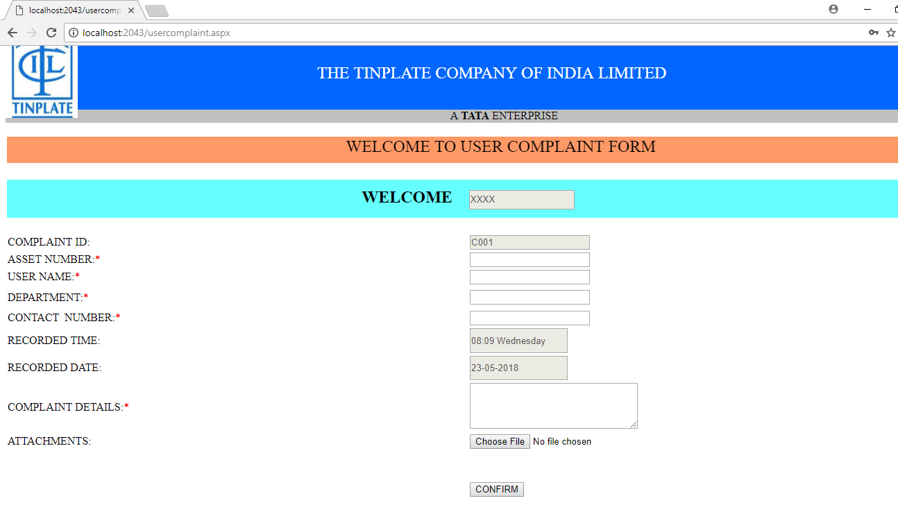
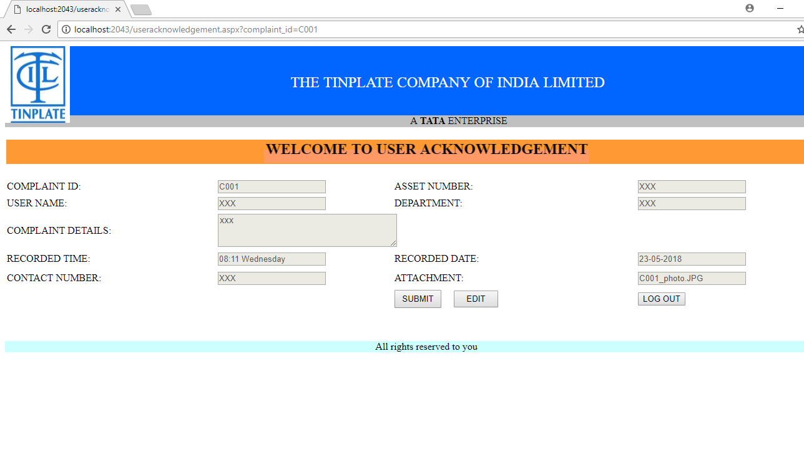
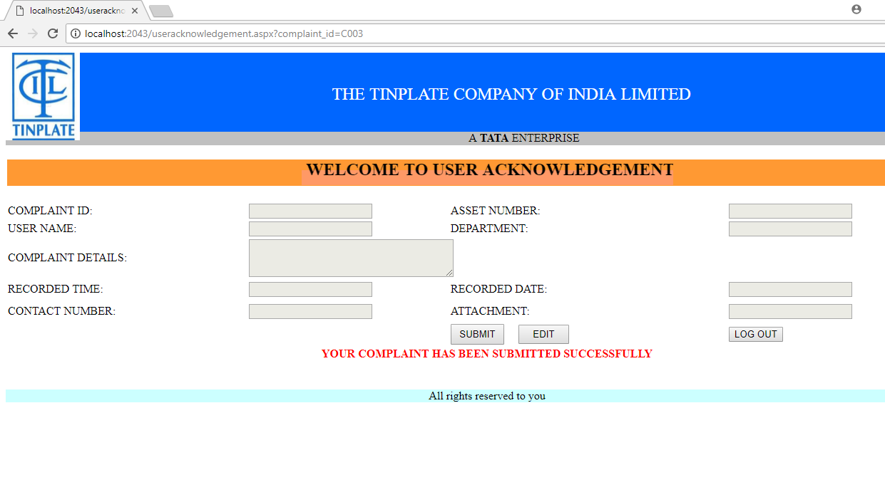

# TCIL-CRS
> This project was made during the summer internship at TCIL. The TCIL-CRS is about the "Complaint Registration Service" which help users to log their complaints for their company assets in a much easy and practical manner. The company assets can be Laptop, Desktop, Air conditioners, Software related etc.  

## Table of contents
* [General info](#general-info)
* [Screenshots](#screenshots)
* [Technologies](#technologies)
* [Setup](#setup)
* [Features](#features)
* [Inspiration](#inspiration)
* [Contact](#contact)

## General info
The website is made on .Asp Net and C# environment. Most of the interface has been inspired the authentic TCIL color scheme. 

## Screenshots

## Technologies
* HTML5
* CSS 
* C#
* .Asp Net
* MS Access and MYSQL
* Visual Studio

## Setup
The whole project can be downloaded to the local system. Just open the home.aspx for opening the main page. From there we can move around the webpages. 

## Features
* At present all the difficulties which were present before has been eliminated like for eg: Data Redundancy, Data missing or Data corrupt issue. 
* The existing system was outdated and had too many dependency on physical labour. 
* The proposed system has covered all the points and has been desiged accordingly.

To-do list:
* As of now there is no issue regarding the website. 
* Later we could add an alert and OTP feature onto the website which will help the user in a more practical way.
* We also have a plan to add a embedded map feature inside the website which will help the user to locate the actual workplace if needed. 
* An emergency feature is also needed for the assets which are targeted for insurance.

## Status
Project is in complete state as of now. Feel free to update the code which might be useful for the project but let us validate it once. 

## Inspiration
To improve the work place and the method of keeping records made us inspire for taking up such project in our internship. This not only helped us to work on such great project but the practicality of the project also helped the actual users of the website. For security purpose some of the files are missing which contains the actual data. The data whcih we are using here is dummy data. 

## Contact
Created by [@yesabhishek] - feel free to contact me!
Email: choudhuryabhishek76@gmail.com
